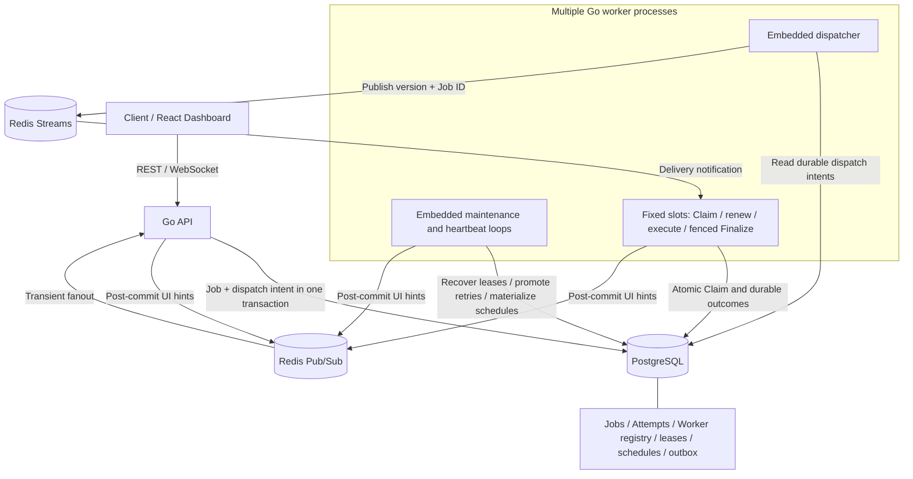

# FlowForge

Distributed Job Processing Platform built with Go, PostgreSQL and Redis.
It explores reliable asynchronous execution across multiple workers under
crashes, retries, duplicate delivery and changing load, with durable ownership
and failure tests that make the recovery model inspectable.

**[v1.0.0 Released](https://github.com/Daniel-Cpz/FlowForge/releases/tag/v1.0.0)** |
[Release review](docs/reports/v1.0.0-release-review.md) |
[Release report](docs/reports/v1.0.0-release.md) |
[Architecture](#architecture) | [Benchmarks](#measured-baseline) |
[Documentation](#documentation)

```text
Submit → Persist → Notify → Schedule → Execute → Recover / Retry → Complete / DLQ
```

## Project Status

**Released · Maintenance / Portfolio.** The production-like Docker topology is
validated locally and in GitHub CI. Real VPS/EC2 deployment has not been performed
and is optional under the [release scope decision](docs/decisions/0012-v1-local-production-acceptance.md).
The repository remains private; links require repository access.

## Why FlowForge?

A worker can disappear after starting work, delivery can repeat, and the database
and queue cannot commit together. FlowForge addresses these cases with explicit
Job transitions, preserved Attempt history, durable dispatch intents and leases.
The central question is when a worker has authority to execute and persist a
result, and how another worker safely takes over after that authority expires.

## Highlights

| Area | Engineering capabilities |
|---|---|
| Reliable execution | PostgreSQL Job state machine and preserved Attempt history |
| Reliable execution | Multiple worker processes, fixed execution slots and heartbeats |
| Reliable execution | DB-time leases, stale-owner fencing and crash recovery |
| Delivery and failure | Durable dispatch intent and at-least-once execution |
| Delivery and failure | Submission idempotency with canonical replay/conflict checks |
| Delivery and failure | Budgeted retries, exponential backoff/equal jitter and DLQ redrive |
| Delivery and failure | Attempt deadlines, cooperative cancellation and bounded shutdown |
| Scheduling | Non-preemptive priority, delayed eligibility and capability-aware Claim |
| Scheduling | Fixed-interval templates with atomic occurrence materialization |
| Operations | REST/WebSocket Dashboard, bounded telemetry and repeatable failure tests |

## Architecture



**PostgreSQL is authoritative.** Job/Attempt state, ownership, eligibility and
dispatch intent survive independently of Redis. Redis Streams carries minimal
delivery notifications; a separate Pub/Sub channel carries lossy UI hints.
Every worker process embeds its dispatcher and maintenance loops alongside
**C fixed slots** (default 1, range 1–32); N processes bound execution to N × C.

The composition root wires transport and persistence into services. Domain and
service packages do not import database or transport packages. See
[architecture](docs/architecture.md) and [worker operations](docs/worker-operations.md).

## Worker Crash Recovery

```mermaid
sequenceDiagram
    participant A as Worker A
    participant DB as PostgreSQL
    participant R as Healthy worker maintenance
    participant Q as Dispatcher / Redis
    participant B as Worker B
    A->>DB: Atomic Claim: RUNNING + Attempt + owner + lease
    Note over A: Hard crash; heartbeat and renewal stop
    Note over DB: Lease expires at database time
    R->>DB: Close old Attempt: FAILED / lease_expired
    alt No cancellation and Attempt budget remains
        R->>DB: Persist RETRYING with retry_at; clear ownership
        R->>DB: When due: QUEUED + dispatch intent atomically
        Q->>DB: Read committed dispatch intent
        Q->>B: Redis delivery notification
        B->>DB: Claim new Attempt and lease
        B->>DB: Fenced Finalize: SUCCEEDED + Attempt outcome
    else Cancellation requested or budget exhausted
        R->>DB: Settle CANCELLED or DEAD_LETTER
    end
    A-->>DB: Late renew / Finalize if old process recovers
    DB-->>A: Reject expired or mismatched owner / Attempt
```

Claim, renewal and finalization check the current worker identity, Attempt number,
RUNNING state and **unexpired PostgreSQL-time lease**. The old owner cannot renew
or overwrite the new owner's result, even if it resumes later.
Recovery requires a healthy maintenance loop and reachable PostgreSQL; continued
delivery/execution also requires healthy workers and Redis. Crashes consume the
same total Attempt budget as other execution failures.

[Lifecycle contract](docs/job-lifecycle.md) ·
[Lease and fencing decision](docs/decisions/0005-db-time-leases-and-recovery.md)

## Delivery Semantics

**At-Least-Once:** execution may repeat during failure recovery. A committed
Job/dispatch intent is reconciled into Redis notifications; publication can
duplicate, and a crashed execution can be attempted again.

- **Submission idempotency:** an exact global key and the same canonical request
  replay the original logical Job. A changed request conflicts; replay does not
  redispatch work or reset its budget.
- **Execution idempotency:** repeated delivery cannot create concurrent valid DB
  owners, but the executor may run again after lease expiry.
- **Business effects:** charges, email and external writes need application-level
  deduplication or downstream fencing. Database lease fencing protects FlowForge
  state; it does not make arbitrary external effects exactly once.

## Key Design Decisions

| Decision | Reason and evidence |
|---|---|
| PostgreSQL authority and transactional outbox | Persist Job and delivery intent together; reconstruct notifications after Redis loss. [ADR 0003](docs/decisions/0003-durable-dispatch-and-single-worker.md) |
| DB-time execution leases | Ownership expires against one database clock; stale writes fail fencing checks. [ADR 0005](docs/decisions/0005-db-time-leases-and-recovery.md) |
| Fixed worker slots | Bound in-flight deliveries, executions and connection use. [ADR 0004](docs/decisions/0004-fixed-worker-pool.md) |
| Minimal Redis messages | Keep payload/state in PostgreSQL and share a small delivery protocol. [ADR 0003](docs/decisions/0003-durable-dispatch-and-single-worker.md) |
| Explicit retry budget and replay identity | Crashes consume budget; redrive preserves history and original submission identity. [ADR 0006](docs/decisions/0006-budgeted-retries-and-submission-idempotency.md) |
| REST repair for transient UI hints | Initial connection, reconnect and periodic snapshots restore the UI from authoritative state. [ADR 0009](docs/decisions/0009-dashboard-realtime-resync.md) |
| Single-host release with safe abort | Validate backup/drain/migration/health gates; preserve data on failure without automatic downgrade. [ADR 0012](docs/decisions/0012-v1-local-production-acceptance.md) |

## Scheduling

Priority is **non-preemptive** and ranks only due Jobs compatible with the claiming
worker. Delayed Jobs wait for PostgreSQL time without consuming an Attempt or
execution deadline. Each worker UUID has an immutable canonical capability set;
Claim requires that set to contain all Job requirements. Unmatched work remains
durable backlog, with no fairness or matching-latency guarantee.

Recurring templates use fixed intervals. One transaction creates a unique
`(schedule_id, scheduled_for)` Job and dispatch intent and advances the template
cursor. After downtime, it creates the oldest due occurrence and skips missed
middle intervals. Canceling a template prevents future materialization; existing
Jobs continue. Cron, template editing and pause/resume are unimplemented.

[Scheduling contract and examples](docs/scheduling.md)

## Measured Baseline

Recorded on 2026-10-05 UTC: **SLEEP 25ms**, C=1 per worker, 500 measured Jobs per
run, three repetitions per worker count and HTTP concurrency 16. Each run used a
fresh schema-8 PostgreSQL/Redis pair with tmpfs storage; warmups were excluded.
The Windows/Docker Desktop host had an Intel Core Ultra 7 270K Plus, 24 logical
cores and ~31.52 GiB RAM (~15.38 GiB in the Linux VM), with desktop background load.
Go 1.26.8, PostgreSQL 18 and Redis 8.2; metrics enabled, tracing/scrapers disabled.

| Workers | Mean Jobs/s | Min–max Jobs/s | Mean queue P95 (s) | Mean end-to-end P95 (s) |
|---|---:|---:|---:|---:|
| 1 | 33.16 | 33.15–33.17 | 14.254 | 14.281 |
| 4 | 56.94 | 17.80–127.80 | 16.662 | 16.689 |
| 8 | 140.39 | 95.99–219.78 | 3.542 | 3.568 |
| 16 | 37.98 | 16.11–81.59 | 22.236 | 22.263 |

Values are copied from the recorded aggregates: arithmetic means of per-run
throughput and per-run P95s, **not pooled-job percentiles**. All 6,000 measured
Jobs succeeded with zero submit/terminal/poll errors; every repetition is retained.
Large variance and slower high-count runs do **not establish linear scalability**.
These machine/workload-specific results are not a production SLA; tmpfs and SLEEP
do not represent production storage or CPU work. No causal profiling was performed.

[Full environment, raw repetitions and limitations](docs/benchmarks/phase-9-baseline.md)

## Reliability Validation

The [formal release/main CI](https://github.com/Daniel-Cpz/FlowForge/actions/runs/37315890293)
and [publication receipt main CI](https://github.com/Daniel-Cpz/FlowForge/actions/runs/37317589831)
passed. Recorded coverage includes:

- Hard-kill → lease expiry → failed old Attempt → new Attempt → success;
  late-owner fencing, retry budgets, DLQ/redrive and cancellation.
- Bounded graceful shutdown and dependency-failure behavior.
- Production-like Compose with PostgreSQL TLS, Redis authentication, private
  gateway access and internal metrics; HTTPS tested using a disposable trusted CA.
- WebSocket reconnect and REST repair against real services.
- Custom-format PostgreSQL backup/restore identity checks and volume restart
  persistence; deployment preflight failures safely abort.

[Completion evidence](docs/reports/phase-10-completion.md) ·
[Independent release review](docs/reports/v1.0.0-release-review.md)

## Quick Start

Clone with repository access, then use Docker with Compose and a **fresh compatible
database**. Copy the environment file and replace its PostgreSQL password placeholder
before starting. Root Compose is a loopback development/demo environment.

```sh
git clone https://github.com/Daniel-Cpz/FlowForge.git
cd FlowForge
cp .env.example .env
# Edit .env with a local development password; check host ports are free.
docker compose up --build -d
docker compose ps
curl http://localhost:8080/ready
```

Wait for `/ready` to return 200, then submit and inspect a demonstration Job:

```sh
curl -i -X POST http://localhost:8080/api/v1/jobs \
  -H 'Content-Type: application/json' \
  -d '{"type":"SLEEP","payload":{"duration_ms":250}}'
# Replace UUID with the returned id:
curl http://localhost:8080/api/v1/jobs/UUID
curl http://localhost:8080/api/v1/jobs/UUID/attempts
```

PowerShell: use `Copy-Item .env.example .env` and `curl.exe`; see
[local setup and commands](docs/development.md). Port overrides live in `.env`.
The retained schema-4 fixture has legacy duplicate keys: follow the
[upgrade preflight](docs/worker-operations.md#upgrade-preflight) before reusing it.

## API Overview

| Endpoint | Purpose |
|---|---|
| `GET /health`, `GET /ready` | Process liveness and dependency/schema readiness |
| `POST /api/v1/jobs` | Submit or replay a logical Job |
| `GET /api/v1/jobs`, `GET /api/v1/jobs/{id}` | Cursor-paginated list and inspection |
| `POST /api/v1/jobs/{id}/cancel` | Durable cancellation intent |
| `GET /api/v1/jobs/{id}/attempts` | Preserved execution history |
| `GET /api/v1/dead-letter` | Inspect exhausted/permanently failed work |
| `POST /api/v1/jobs/{id}/retry` | Explicit DLQ redrive with one extra Attempt |
| `POST /api/v1/schedules`, `GET /api/v1/schedules` | Create/list fixed-interval templates |
| `GET /api/v1/schedules/{id}`, `POST /api/v1/schedules/{id}/cancel` | Inspect/cancel future occurrences |
| `GET /api/v1/workers`, `GET /api/v1/dashboard/summary` | Worker registry and snapshot counts |
| `GET /api/v1/ws` | Transient realtime invalidation hints |
| `GET /metrics` | Internal Prometheus diagnostics when enabled |

[Full API contract](docs/api.md): fields, errors, strict JSON envelope parsing,
submission identity, cursor boundaries, control semantics and execution payloads.

## Dashboard & Observability

The React/TypeScript Dashboard exposes Overview, Jobs/detail/Attempts, Workers,
Schedules and DLQ controls. WebSocket hints trigger REST refreshes; reconnect and
30-second reconciliation repair missed hints. Dashboard state comes from PostgreSQL.

Prometheus/Grafana provide queue, execution and worker diagnostics. OpenTelemetry
hooks correlate API → dispatch → Attempt using bounded, optional export.
Job IDs, keys and payloads are excluded from metric labels; telemetry failure
cannot change durable outcomes. The Collector debug exporter is not durable trace storage.

[Dashboard setup](docs/development.md#dashboard-setup) ·
[Metrics, tracing and Grafana](docs/observability.md)

## Tech Stack

| Layer | Technologies |
|---|---|
| Backend | Go 1.26+, standard net/http, log/slog, pgx v5, go-redis v9 |
| Data / coordination | PostgreSQL 18, Redis 8.2 |
| Frontend | React, TypeScript, Vite |
| Observability | Prometheus, Grafana, OpenTelemetry |
| Infrastructure / validation | Docker, Docker Compose, Caddy, GitHub Actions |

## Feature Matrix

| Area | Status |
|---|---|
| Durable Job FSM / multi-worker execution / leases and fencing | Implemented; failure cases validated |
| Submission idempotency / retry / DLQ / timeout / cancellation | Implemented; validated |
| Priority / capability-aware Claim / delayed / recurring Jobs | Implemented; validated |
| Dashboard / WebSocket repair / metrics and trace hooks | Implemented; service and frontend tests validated |
| Production-like Compose / backup / restore / restart | Validated locally and in GitHub CI |
| Real VPS/EC2 / GHCR publication / protected SSH deployment | Optional; not performed |
| HA / autoscaling / application users and RBAC | Not implemented |

## Known Limitations

- Execution may repeat; external effects need business idempotency or fencing.
- Single-host reference topology; no HA, autoscaling or latency/recovery SLA.
- **SLEEP is the only executable demo Job type**; other types fail permanently.
- No application users, sessions or RBAC. Keep the development API internal.
- No real cloud/public ACME validation. **No authorized VPS/EC2 deployment target
  is currently available.** Local HTTPS evidence uses a disposable CA.
- Browser E2E, off-host disaster recovery and durable trace storage are not validated.
- PostgreSQL `sslmode=require` encrypts without certificate identity verification;
  Redis has authentication without TLS on the private container network.
- Benchmark results are workload/environment specific; priority can starve work,
  notification matching has no fairness SLA, and automatic history/stream retention
  is unimplemented. See [operational limits](docs/worker-operations.md) and
  [deployment boundaries](docs/deployment.md).

## Documentation

| Read next | Contents |
|---|---|
| [Architecture](docs/architecture.md) / [ADRs](docs/decisions/README.md) | Boundaries, tradeoffs and failure model |
| [API](docs/api.md) / [Lifecycle](docs/job-lifecycle.md) | Exact requests, states and Attempt semantics |
| [Worker operations](docs/worker-operations.md) / [Scheduling](docs/scheduling.md) | Leases, budgets, shutdown and eligibility |
| [Development](docs/development.md) | Environment, commands, migration and retained-data preflight |
| [Dashboard](docs/dashboard.md) / [Observability](docs/observability.md) | REST repair, UI, metrics and tracing |
| [Deployment](docs/deployment.md) / [Artifact bundle](deploy/README.md) | Production-like topology and optional authorized deployment |
| [Benchmarks](docs/benchmarks/phase-9-baseline.md) | Recorded workload, raw repetitions and limits |
| [Release notes](docs/releases/v1.0.0.md) / [Reports](docs/reports/) | Release and historical acceptance evidence |
| [Roadmap](docs/development-roadmap.md) / [Automation protocol](docs/phase-automation.md) | Development history and handoff rules |

## Project Evolution

v1.0.0 represents ten incremental engineering phases:

```text
Persistence/API → Queue/Worker → Multi-Worker Concurrency → Lease Recovery
→ Retry/Idempotency → Control/DLQ → Scheduling → Dashboard
→ Observability/Benchmark → Production Hardening
```

The roadmap is complete. Further work requires an owner decision; no Phase 11 is
planned by this documentation update. Historical reports retain their original
scope and evidence. The v1.0.0 tag and Release remain immutable; portfolio
documentation evolves on post-release `main`.

## License

MIT — see [LICENSE](LICENSE).
