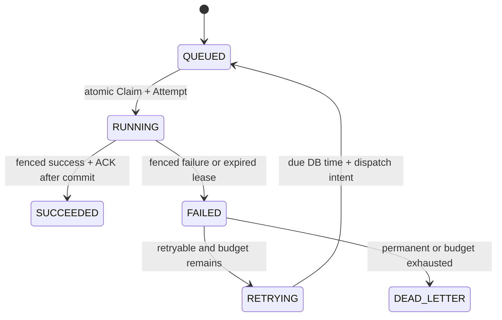

# Job lifecycle

Status: execution, leases, budgeted retries and submission idempotency implemented.

| From | Allowed targets |
|---|---|
| QUEUED | RUNNING, CANCELLED |
| RUNNING | SUCCEEDED, FAILED, TIMED_OUT, CANCELLED |
| FAILED | RETRYING, DEAD_LETTER |
| RETRYING | QUEUED |
| SUCCEEDED, DEAD_LETTER, CANCELLED, TIMED_OUT | none |

Unknown/self/absent edges fail without changing the Job. The graph is centralized
in domain; durable authority requires repository transactions and SQL fences.
There is no HTTP state-change endpoint. Priority/timeout/user cancellation and
DLQ management remain planned, despite reserved graph states.

FAILED is an intermediate logical transition for Phase 5 failures; one transaction
persists RETRYING or DEAD_LETTER, so observers need not see transient FAILED.
Historical FAILED Jobs remain unchanged and are not automatically retried.

## Job and Attempt

Creation starts QUEUED/count 0. Claim alone increments count and inserts a unique
(job_id,attempt_number) Attempt. max_attempts is the total execution budget (1..100),
including business failures, expired leases and operational interruptions.
Duplicate delivery, failed claim, replay and retry promotion consume no budget.
No N+1 Attempt is created after exhaustion. Sequence and old Attempts are retained.

Attempt states record execution, not scheduling: RUNNING, SUCCEEDED, FAILED and
reserved TIMED_OUT/CANCELLED. A failed Attempt records stable error/result/end time;
the corresponding Job may be RETRYING or DEAD_LETTER. Success Job/Attempt share
result and completion time. Historical attempts need not match current Job status.

retry_at is a nullable TIMESTAMPTZ, UTC RFC3339 on HTTP. Only RETRYING has it;
RETRYING has no assigned_worker/lease and must have remaining budget. Success and
DEAD_LETTER clear retry_at/lease. DEAD_LETTER also clears current assigned_worker;
its Attempt retains worker identity. QUEUED/RUNNING start with retry_at null.

## Failure, scheduling and ACK

Only SLEEP executes in production: exactly one duration_ms integer in 0..10000.
Unsupported type/invalid SLEEP payload are permanent failures after one Attempt,
ending DEAD_LETTER. execution_cancelled is a retryable process interruption,
not user cancellation. lease_expired uses the identical retry budget/policy.
Panic or ambiguous renewal leaves RUNNING for expiry recovery without guessing.

Equal jitter uses a bounded exponential cap, default base 1s/max 30s, actual delay
in [cap/2,cap]. PostgreSQL time establishes schedule and due eligibility. Delay is
never zero. RETRYING is durable across worker/process restart and Redis loss.
Bounded concurrent promotion commits RETRYING -> QUEUED plus intent reset together;
dispatch later publishes. No transaction crosses SLEEP, Redis or a waiting timer.

Finalize requires RUNNING + matching owner/attempt + currently valid DB lease.
Recovery requires an expired DB lease and locks exact old execution. Both close
Attempt and settle Job atomically, using RUNNING -> FAILED -> target. Stale owner
cannot renew or overwrite recovery. Missing/corrupt history rolls back the batch.

ACK follows success, DEAD_LETTER or RETRYING commit. Failed settlement leaves
RUNNING/pending and stops the process; failed ACK leaves the committed outcome
intact. Malformed/missing/non-QUEUED deliveries ACK only themselves. Ambiguous
commit is resolved from DB truth. Old pending messages are retained; no reclamation
or retention management is added. Healthy worker/DB/Redis are required for progress.

## Submission idempotency

The exact non-null global key identifies canonical type, JSONB payload, priority,
max_attempts and timeout. First submission returns 201; same request replay returns
200 with original Job/Location at any state; different request returns 409
IDEMPOTENCY_CONFLICT and changes nothing. Null/absent keys always create distinct
Jobs. Replay creates no Attempt/intent and does not restart terminal work.

## Constraints and migrations

Database constrains status membership, numeric bounds, attempt_count<=max_attempts,
retry/status consistency and key uniqueness. It does not duplicate the transition
graph in triggers. Domain and scan validation reject corrupt stored data.

000001 jobs, 000002 Attempts, 000003 dispatch and 000004 worker leases remain
immutable. 000005 appends retries/idempotency. Duplicate-key preflight fails
atomically without deleting/merging Jobs. Legacy count>100 requires explicit review;
over-budget <=100 counts freeze max_attempts at the actual count and exhausted
QUEUED Jobs normalize administratively to DEAD_LETTER, preserving history.
Legacy RETRYING gets a DB-time one-second schedule. Down removes new objects but
never erases history or restarts normalized work. Stop workers before schema changes.
